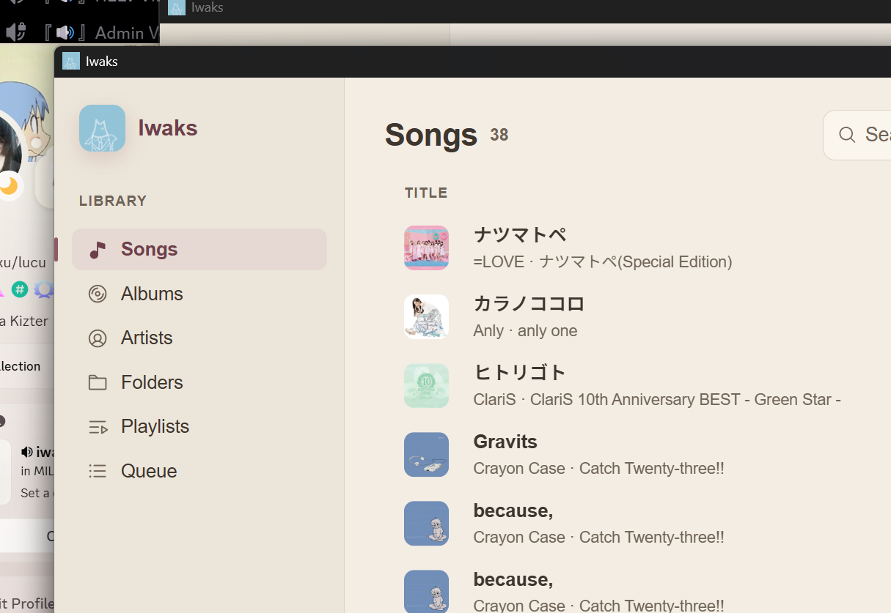

# Iwaks


**Hi-res & lossless offline music player for Windows**, built with Tauri v2 (Rust) and React/TypeScript. The audio engine is libmpv over WASAPI in shared mode by default, with exclusive mode available as an opt-in.



## Features

- Scanner with metadata tags, FTS5 search, and an incremental re-scan that only picks up changed files
- Playback for FLAC, WAV, ALAC, MP3, AAC, OGG, Opus, WavPack, AIFF, WMA Lossless, and DSD (DSF/DFF)
- 10-band EQ with preamp, ReplayGain (track or album), sleep timer, and playback speed
- Embedded lyrics plus `.lrc` sidecars with synced highlighting
- Playlists with `.m3u` import/export, and a session queue you can drag to reorder and save as a playlist
- Folder browsing with breadcrumbs, a tag editor with `.bak` backup, and a draggable mini player

## Install

Download the latest installer from [Releases](https://github.com/Kizter/iwaks/releases), or build it yourself:

```bash
npm run tauri build
```

Each release ships a `*.sha256` file next to the installer to verify the download:

```powershell
Get-FileHash .\Iwaks_0.1.0_x64-setup.exe -Algorithm SHA256
```

> [!NOTE]
> The installer is not code-signed. Windows SmartScreen will show "Windows protected your PC" on the first run. Click **More info**, then **Run anyway**. This should disappear once we sign releases.

For now the app targets Windows x64 with the WebView2 runtime bundled in Windows 11.

## Development

Prerequisites: Rust stable (MSVC toolchain), VS 2022 Build Tools with the "Desktop development with C++" workload, Node.js 22+, and the libmpv DLL fetched once:

```powershell
powershell -ExecutionPolicy Bypass -File scripts/fetch-libmpv.ps1
```

Then:

```bash
npm install
npm run tauri dev
```

## Tests & quality

```bash
npm run build          # type-check (tsc) + production bundle (vite)
cd src-tauri && cargo test && cargo clippy && cargo fmt --check
```

CI runs the same checks on every push to `main`. Build and CI timings are tracked in `.ecc/benchmarks/build.json` (see `scripts/benchmark.ps1`).

The full design and decision log live in [`docs/design.md`](docs/design.md).

License: [MIT](LICENSE)